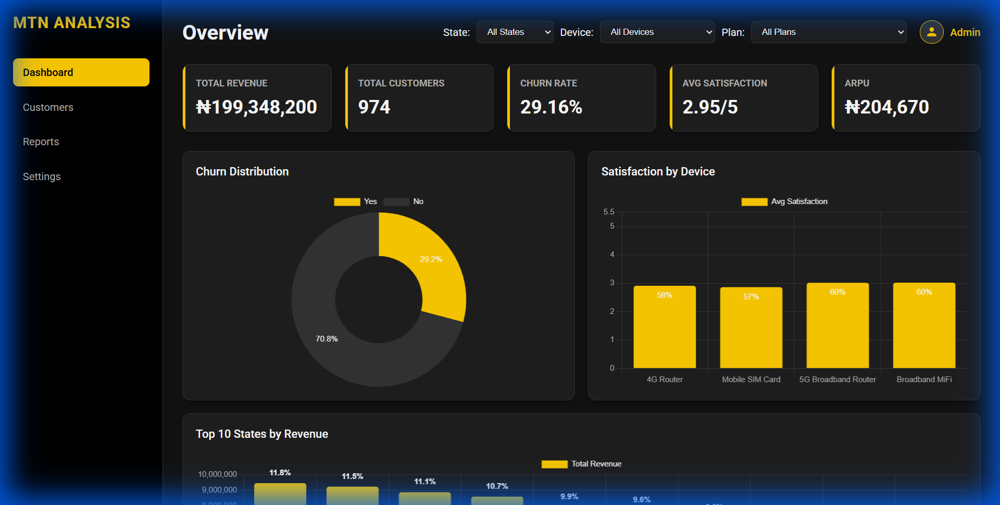
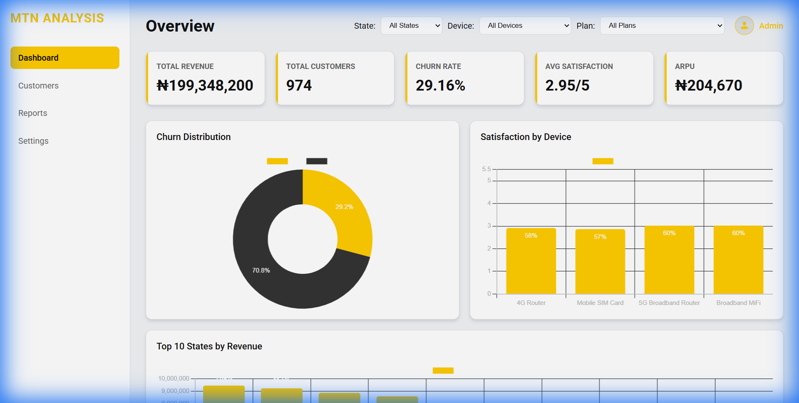
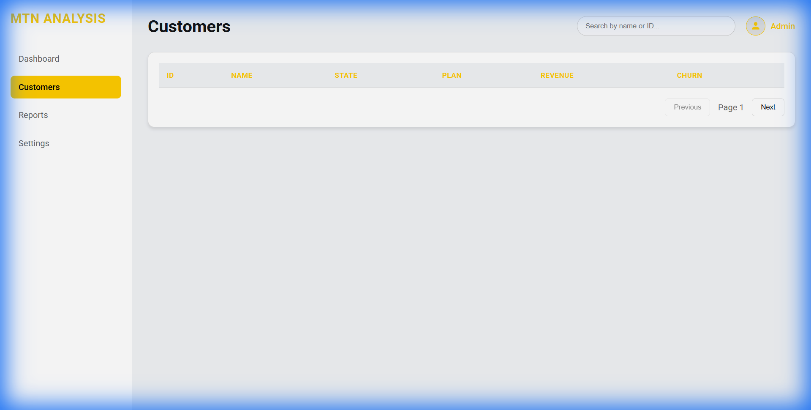
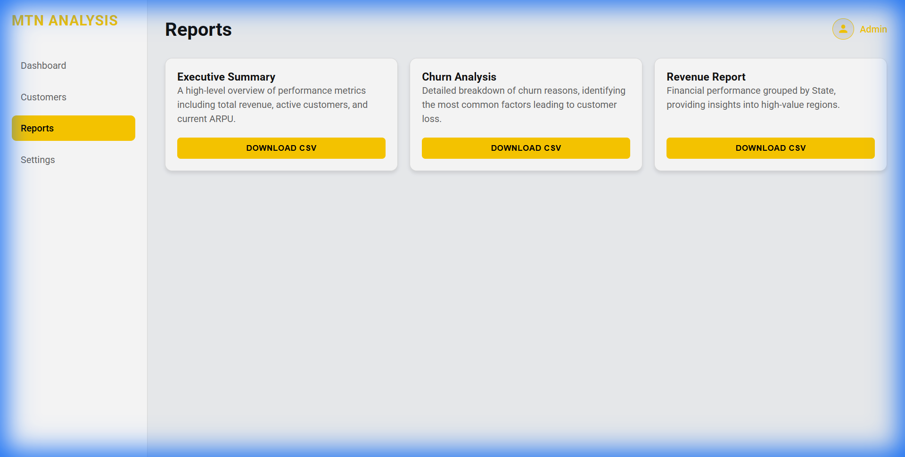
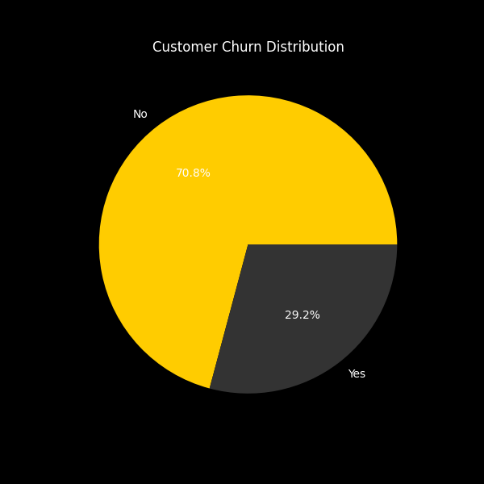
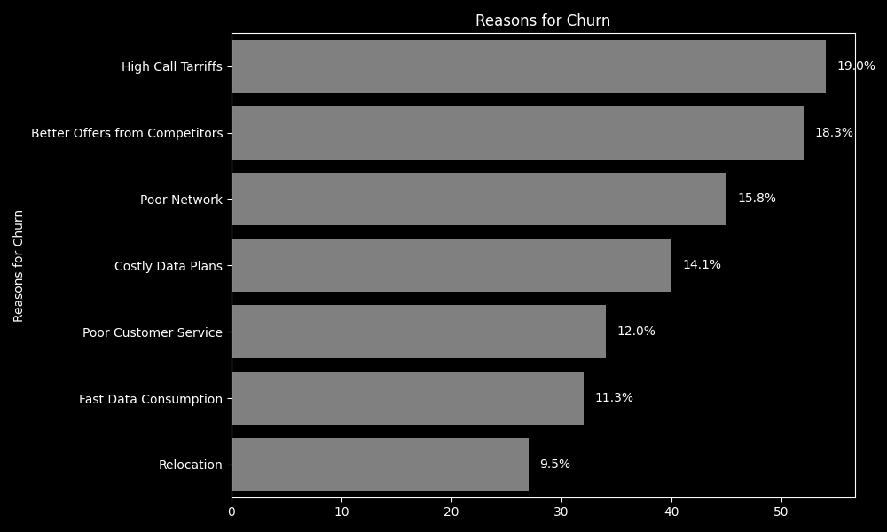
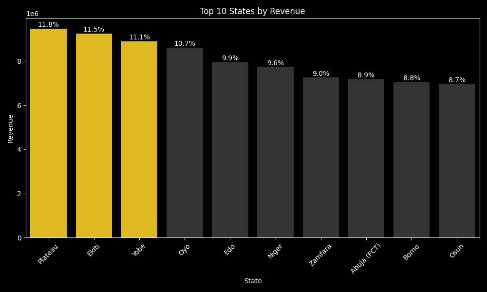

# MTN Customer Churn & Revenue Analysis Dashboard
[](https://opensource.org/licenses/MIT)
[](https://www.python.org/)
[](https://pandas.pydata.org/)

## Table of Contents
- [Project Overview](#project-overview)
- [Key Features](#key-features)
- [Technology Stack](#technology-stack)
- [Prerequisites](#prerequisites)
- [Installation and Setup](#installation-and-setup)
- [Usage](#usage)
- [Data Description](#data-description)
- [Analysis](#analysis)
- [Dashboard Screenshots](#dashboard-screenshots)
- [Contributing](#contributing)
- [Contact](#contact)

## Project Overview

This project is a comprehensive data analysis dashboard designed to visualize key performance indicators (KPIs) for MTN, a leading telecommunications company in Nigeria. It provides deep insights into customer behavior, revenue streams, churn patterns, and satisfaction levels across different demographics and devices. The dashboard aims to help stakeholders make data-driven decisions to improve customer retention, optimize revenue, and enhance overall service quality.

The project includes both a static web-based dashboard and Python scripts for data processing and analysis, along with generated SQL scripts for database integration.

## Key Features

- **Interactive Design**:
  - **Dynamic Filtering**: Filter data in real-time by **State**, **Device**, and **Subscription Plan**.
  - **Searchable Tables**: Full customer directory with search and pagination functionality.
- **Advanced Theming**:
  - **Light & Dark Modes**: A professionally designed theme toggle that persists across sessions using Local Storage.
  - **Semantic Styling**: Seamless transitions between themes with consistent color palettes for charts and UI elements.
- **Exportable Reports**: Capability to download detailed CSV reports for Executive Summaries, Churn Analysis, and Revenue Data.
- **Data Analysis Scripts**: Python scripts for data cleaning, visualization generation, and SQL export.

## Technology Stack

- **Frontend**: HTML5, CSS3 (Variables & Flexbox/Grid), JavaScript (ES6+).
- **Charts**: Chart.js for responsive and interactive data visualization.
- **Data Handling**: Client-side data processing with search and filter logic.
- **Persistence**: `localStorage` used for theme preference retention.
- **Backend/Analysis**: Python 3 with libraries: Pandas, Matplotlib, Seaborn.
- **Database**: SQL scripts for data storage and querying.


## Prerequisites

- Python 3.7 or higher
- Web browser (Chrome, Firefox, Safari, etc.) for viewing the dashboard
- (Optional) A database system like MySQL or PostgreSQL to run the SQL scripts

## Installation and Setup

1. **Clone the Repository**:
   ```bash
   git clone <repository-url>
   cd "MTN customers dataset"
   ```

2. **Set up Python Environment**:
   - Install required Python packages:
     ```bash
     pip install pandas matplotlib seaborn
     ```

3. **Run Data Analysis** (Optional - to regenerate visualizations and data files):
   - Update the file paths in `analysis.py` to match your local directory structure.
   - Run the analysis script:
     ```bash
     python analysis.py
     ```
   - This will generate updated visualizations, JSON summaries, and SQL scripts.

4. **View the Dashboard**:
   - Open `dashboard/index.html` in your web browser.
   - No server required; it's a static website.

## Usage

1. **Navigate the Dashboard**:
   - Use the main dashboard (`index.html`) to view overall KPIs and charts.
   - Switch to `customers.html` for a detailed customer list with search and filters.
   - Access `reports.html` to download CSV reports.
   - Customize themes in `settings.html`.

2. **Interacting with Visualizations**:
   - Hover over charts for detailed tooltips.
   - Use filters to drill down into specific data segments.
   - Toggle between light and dark modes for better viewing.

3. **Running Analysis Scripts**:
   - Execute `analysis.py` to process raw data and generate new insights.
   - Use `analysis.sql` to set up a database with the customer data for further querying.

## Data Description

The dataset (`mtn_customer_churn.csv`) contains information about MTN customers, including:

- **Customer_ID**: Unique identifier for each customer
- **Full_Name**: Customer's full name
- **Date_of_Purchase**: Date of service purchase
- **Age**: Customer age
- **State**: Nigerian state of residence
- **MTN_Device**: Type of device (e.g., 4G Router, Broadband MiFi, Mobile SIM Card)
- **Gender**: Customer gender
- **Satisfaction_Rate**: Rating from 1-5
- **Customer_Review**: Textual review (Poor, Fair, Good, Very Good, Excellent)
- **Customer_Tenure_Months**: Length of service in months
- **Subscription_Plan**: Plan details
- **Unit_Price**: Price per unit
- **Number_of_Times_Purchased**: Purchase frequency
- **Total_Revenue**: Total revenue generated
- **Data_Usage**: Data consumption
- **Customer_Churn_Status**: Whether the customer has churned (Yes/No)
- **Reasons_for_Churn**: If churned, the reason (e.g., Relocation, Poor Network, Better Offers)

## Analysis

The analysis focuses on key business metrics:

- **Customer Churn**: Detailed breakdown of churn rates and reasons (e.g., Relocation, Network Quality, Competition), helping to identify retention strategies.
- **Revenue Performance**: Analysis of Total Revenue and Average Revenue Per User (ARPU), grouped by State to highlight high-performing regions.
- **Customer Satisfaction**: Satisfaction scores (1-5) correlated with device types (Routers, MiFis, Mobile) to pinpoint hardware-related user experience issues.
- **Demographics**: Insights into subscription plans and customer distribution.

The `analysis.py` script performs data cleaning, generates visualizations (saved to `dashboard/images/`), and exports processed data for the dashboard.

## Dashboard Screenshots

### Dashboard Overview (Dark Mode)

The default command center view, featuring high-contrast charts for easy readability.


### Dashboard Overview (Light Mode)

A clean, professional light theme perfect for daytime presentation / printing.


### Customer Directory

Searchable and paginated list of all customers with status indicators.


### Reports Center

Dedicated hub for downloading analytical data.


## 📈 Detailed Analysis Visuals

### Churn Distribution

Visual breakdown of the overall churn rate vs. retention.


### Reasons for Churn

Top contributing factors to customer churn, highlighting areas for improvement (e.g., Network Quality).


### Revenue by State

Geographic performance heat map showing high-value regions.


### Satisfaction by Device

Correlation between hardware type and reported customer satisfaction scores.


## Contributing

Contributions are welcome! Please follow these steps:

1. Fork the repository.
2. Create a feature branch: `git checkout -b feature-name`.
3. Make your changes and commit: `git commit -m 'Add some feature'`.
4. Push to the branch: `git push origin feature-name`.
5. Submit a pull request.

Please ensure your code follows the existing style and includes appropriate tests/documentation.


## Contact

For questions or feedback, please contact:
- **Name**: Godwin Akachukwu
- **Email**: ggodsvessel@gmail.com
- **LinkedIn**: [linkedin.com/in/godwingodsvessel](www.linkedin.com/in/godwingodsvessel)

---

*This project is part of a data analysis portfolio demonstrating skills in data processing, visualization, and web development.*
